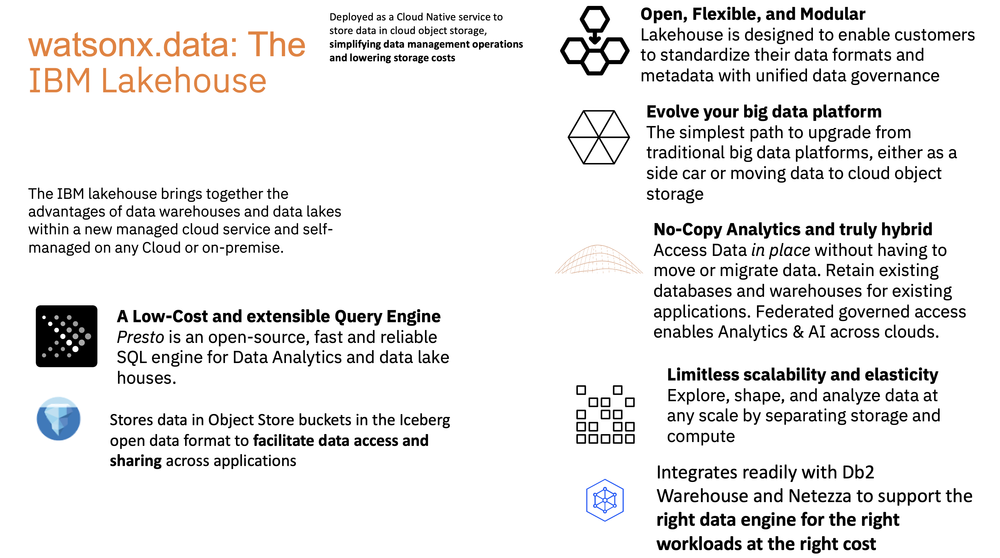
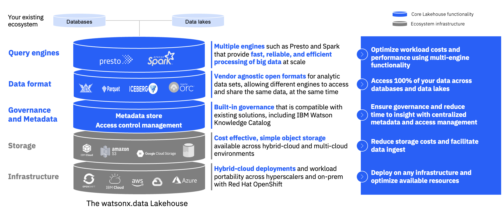

# watsonx-data
Samples, tutorials and other information about watsonx.data

---

## Introduction

IBM® watsonx.data is a hybrid, open data lakehouse to power AI and analytics with all your data anywhere. A key feature is the ability to access all data through a single point of entry with a shared and open metadata layer. The architecture includes the capability to use open table formats, such as Apache Iceberg, also makes it possible for multiple engines and tools to work with the same data concurrently. 

### An open, hybrid and governed data store
IBM® watsonx.data™ data enables you to scale analytics and AI with all your data, wherever it resides, through::

Open formats to access all your data through a single point of entry and share a single copy of data across your organization and workloads, without needing to migrate or recatalog, reducing ETL and data duplication.
Integrated vectorized embedding capabilities to prepare your data for Retrieval Augment Generation (RAG) or other machine learning and generative AI (gen AI) use cases. 
Gen AI-powered conversational interface to easily find, augment and visualize data and unlock new data insights—no SQL required (in tech preview).
Integration with existing databases, tools and modern data stacks.
Hybrid deployment options as fully managed SaaS on IBM Cloud® and AWS or self-managed containerized software on premises.

---
 

 

---

- watsonx.data ("wxd") is available as a Managed Service on IBM and AWS clouds as well as Software on Red Hat OpenShift Kubernetes.  There is also a small footprint Developer version that can be run on a single VM or a laptop. The client package provides utilities to connect to watsonx.data services.

## Use cases

### Cost-optimize your data warehouse
Optimize workloads from your data warehouse by choosing the right engine for the right workload, at the right cost. Replace ETL jobs and reduce costs of your data warehouse by up to 50% through workload optimization

### Modernize your data lake
Extract more value from your data by modernizing ineffective data lakes with warehouse-like performance, security and governance.

### Data store for generative AI
Unify, curate and prepare data efficiently for AI models and applications. Integrated vectorized embedding capabilities enable RAG use cases at scale across large sets of your trusted, governed data. 

### Generative AI-powered data insights
Leverage generative AI infused in watsonx.data to easily find, augment and visualize data and unlock new data insights by way of a conversational interface—no SQL required. Unleash cryptic structured data for AI using auto-generated semantic metadata in natural language for easy self service access to data (coming soon).

### Streamlined data engineering and data virtualization
Reduce data pipelines and simplify data transformation. Query data in one place with data virtualization with Presto, which has over 35 connectors to various external database vendors.

### Real-time analytics and business intelligence
Connect existing data with new data in minutes and unlock new insights without the cost and complexity of duplicating and moving data. Integrate with IBM® Cognos® and other third-party business intelligence and dashboard tools to visualize data and insights

## Benefits

### Reduce your data warehouse cost
With workload optimization across multiple query engines and storage tiers, minimize the cost of your data warehouse by 50% and pair the right workload with the right engine.

### Leverage quality data for AI
Unify, curate and prepare data efficiently for AI models and applications of your choice. Empower your AI with your trusted data.

### Access your data across hybrid cloud
Connect to storage and analytics environments in minutes and access all your data through a single point of entry with a shared metadata layer across clouds and on-premises environments.

## Features

### Fit-for-purpose query engines
Provide fast, reliable and efficient big data processing at scale through multiple engines, such as Presto. Prestissimo(Tech Preview) and Spark. 
Drive analytics costs down with cost-efficient compute and storage and fit-for-purpose analytics engines—Presto, Spark, IBM® Db2®, IBM® Netezza®—that dynamically scale up and down.

### Vector DB support
IBM® watsonx.data™ has recently launched an integrated vector database, based on the open source Milvus, in the data lakehouse. Now, IBM watsonx™ customers can unify, curate and prepare vectorized embeddings for their generative artificial intelligence (gen AI) applications at scale across their trusted, governed data.  The vector DB initially supported is based on open source vector DB Milvus.  This supports upto 100 million vectors of 384 dimensions.

### Built-in governance, security and automation
Ensure enterprise compliance and security using built-in unified governance or connect to existing solutions.

### Vendor-agnostic data formats
Use vendor-agnostic open formats for analytic data sets, including Apache Iceberg table format and Apache Hive metastore. This enables different engines to access and share data simultaneously.

### Cost-effective, simple object storage
Store large volumes of data in low-cost object storage and share it through an open table format built for high-performance analytics

### Hybrid cloud deployments
Seamlessly deploy across any cloud or on-premises environment in minutes with workload portability through Red Hat® OpenShift®. Accelerate on-premises deployment and querying through integration with IBM® Storage Fusion HCI.

### Easy-to-use integrated console
Connect to your existing analytics data across hybrid cloud and deploy query engines in minutes. Explore and transform data with common SQL.

## Get started

- [download the Developer package](developer_package/)

- [download the Client package](client_package/)

- [provision a managed service instance](https://cloud.ibm.com/docs/watsonxdata?topic=watsonxdata-getting-started)

- [deploy on Red Hat OpenShift Kubernetes](https://www.ibm.com/docs/en/cloud-paks/cp-data/4.7.x?topic=services-watsonxdata)

> In this repository, you will see more details on how watsonx.data works as well as tutorials and study materials used in hands-on labs & workshops. These will provide illustrative examples of using specific features & use cases and generally on how best to use watsonx.data for your AI and BI needs.  You will also see examples of integrations with other products and services to introduce how you can expand watsonx.data to broader solutions.

## Component overview

## References

- IBM watsonx.data  Product  site and recorded demos:  https://www.ibm.com/products/watsonx-data

- IBM Cloud Pak for Data ("cpd") Product site:  https://www.ibm.com/products/cloud-pak-for-data

- watsonx.data Documentation: https://www.ibm.com/docs/en/watsonxdata/1.0.x 

- Apache Iceberg: https://iceberg.apache.org/

  - Table format spec:  https://iceberg.apache.org/spec/ 

- Presto: https://prestodb.io/

