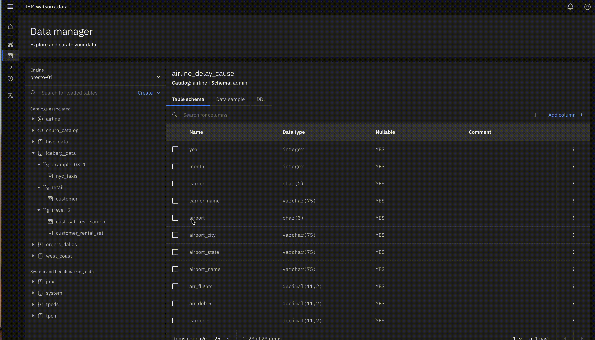

# Protect your data with RBAC and Access Policies

 Traditionally, it is a bit onerous to implement security mechanisms and usability is sacrificed.  watsonx.data introduces a tiered mechanism to protect your data.

- Infrastructure Access Control -  defines Role Based Access Control to resources, such as Engines, Catalogs, Buckets and External databases.

- Access Policies - such policies identify what schema, tables and columns are accessible for Selects/inserts.

## Setup

The watsonx.data developer edition provides a way to add more users to the system.   We will create one user to use in the exercises below.

Check usage:

`ibm-lh-dev/bin/user-mgmt add-user --help`

Add a new user `homer`:

`/root/ibm-lh-dev/bin/user-mgmt add-user homer User testpassword` `

## Infrastructure access

**Exercise 15a):** As `ibmlhadmin` grant `homer` access to the `presto-01` engine with Role `Admin`.

For reference:

**Exercise 15b):** Inspect access to the engine for homer 

- Sign-in to the watsonx.data console, using a Private/Incognito window as user `homer` 

_Note:_  As part of the exercises below, you would need to refresh the `homer` browser to get the up-to-date view of what access has been granted.

See what resources are available to this user in the "Infrastructure" page.  As homer, are you able to see your `retail` schema in the iceberg_catalog ?  

_Note:_  Some out of the box catalog resources are exposed to enable demo purposes.

**Exercise 15c):**   Grant access to all assets in a Catalog

Grant Admin Role to `homer` on the iceberg_data Catalog.

For reference:

 

- as `homer` confirm you can access the retail schema tables.

## Data Access Policies

While granting access to an entire catalog is a simpler way to grant access to data, _policies_  enable you better control and a more _granular_ approach even down to deciding to which _column_ can be accessed.

**Note:**  The policy names can only be characters and digits, no special characters (not even `_` or `-`)

As an example, see: 

**Exercise 15c):** Grant limited access to the `mart.customer`

As `ibmlhadmin`, against the `mart` catalog that you created as part of the [Federated Query exercise](FederatedQuerying.md#add-the-postgresql-database-to-wxd), create a policy that grants access to user `homer` to the table `customer`, but _not_ to the columns `phone`, `address` and `acctbal`. 

As `homer`, try a `select *` from this table and see what the response is.  Then try selecting specific columns and see what `homer` is permitted to see.

---

- return back to the [Main lab exercises](./README.md)

