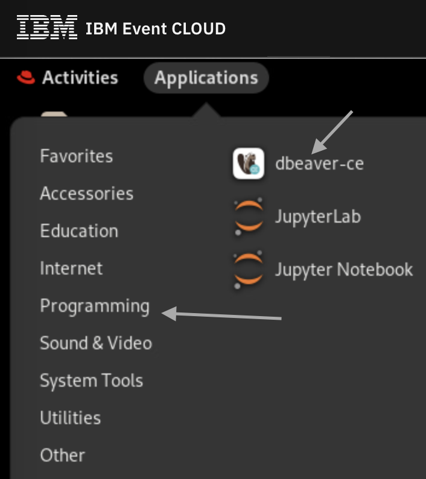
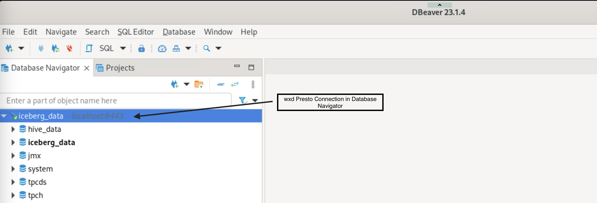

## Connecting to wxd Presto using DBeaver

In the lab environment, you will see a pre-installed version of DBeaver community edition.

### Launching DBeaver

You can launch DBeaver by clicking on `Applications` under the `Programming` folder in the Linux VM as shown below:

</img>

### Navigation

The Presto Server, exposed as `localhost:8443` in the wxd installation should already be registered as a Connection in this DBeaver installation.  You can expand the `iceberg_data` entry in the Database Navigator view in DBeaver to explore the wxd Lakehouse.

Here is an example of the Database Navigator view:

### Working with a table

As part of this lab exercise, drill-down to the `tpcds` schema and select the `customer` table. Then you would open up a SQL editor to run a query.

Use the following recording as a guide, but feel free to explore other tables in the "tiny" or "sf1" schema.

---

- once you are done with DBeaver, return back to the [Main lab exercises](./README.md)