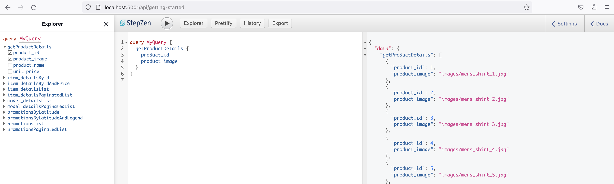

- [Starting Stepzen](#starting-stepzen)
- [Create type system for a selected schema in IBM Lakehouse](#create-type-system-for-a-selected-schema-in-ibm-lakehouse)
- [Deploy GraphQL endpoint](#deploy-graphql-endpoint)
- [Test newly created Lakehouse API](#test-newly-created-lakehouse-api)


## Starting Stepzen
IBM Stepzen is available as a managed service, however we are using a developer edition of the software for the purpose of this lab. The ./start_stepzen.sh will start two containers, one for the stepzen metadata which is stored in PostgreSQL

```
❯ docker ps|grep step
```

```python
5272b1654ba1   us-docker.pkg.dev/stepzen-public/images/stepzen:add_to_keystore                  "/szbin/services"        3 days ago     Up 3 days     8080/tcp, 8088/tcp, 8443/tcp, 0.0.0.0:9077->9000/tcp, :::9077->9000/tcp   stepzen-local
992b90222070   postgres:14                                                                      "docker-entrypoint.s…"   5 days ago     Up 3 days     5432/tcp                                                                  stepzen-metadata
```
you should see the 2 containers as shown above.

## Create type system for a selected schema in IBM Lakehouse
(From GraphQL.com)
Grouping things into their types comes with more than just a label telling us what's inside. When we understand the type of data we're working with, we know what we can and can't do with it while programming: we can do certain things with numbers that we can't with text, for example! The data type we work with determines the kinds of operations and transformations we can perform on it.

GraphQL uses a type system to help us understand what kind of a thing a value is. A type system is a set of rules that defines the possible types of data that we can work with in a programming language. Working within these rules helps us organize our data and how we're using it, and it also makes it easier for us to represent relationships between different types, as we'll see in this article.

We define the specific types for the data we want to query and work with in a document called our GraphQL schema, a schema makes up the comprehensive picture of everything we can do with the data in a GraphQL service. It's a collection of types and fields, along with the specific menu of operations we can use to interact with the data. In this way, the schema is like a contract between the server and the client.

With Stepzen it is just a simple 1 line command

```
❯ export STEPZEN_ENABLE_PRESTO_IMPORT=1 
```
```
❯ stepzen import presto                 
```
```python
stepzen import presto - introspect a Presto database and extend your GraphQL schema with the types, queries and mutations for accessing it through a StepZen API.

? What is your host? ibm-lh-presto-svc:8443
? What is the username? ibmlhadmin
? What is the password? [hidden]
? What is your Presto catalog name? iceberg_data
? What is your database schema? techxchange
? Automatically link types based on foreign key relationships using @materializer
 (https://stepzen.com/docs/features/linking-types) No
Creating a GraphQL schema... done
Successfully imported presto data source into your GraphQL schema

~/Development/stepzen took 10s 
```


## Deploy GraphQL endpoint
Stepzen generates the type system/schema for you, now you have a choice of either accepting the generated schema and the included queries or adding/editing types and/or queries. To inspect the current schema look at the index.graphql 

```
❯ more presto/index.graphql 

```
A small portion of the generated schema below
```python
type Model_details {
  confidence: Float!
  lift: Float!
  support: Float!
}

type Promotions {
  latitude: Float!
  legend: String!
  location_name: String!
  longitude: Float!
  promotion_pct: Int!
}

"""
The following queries are just a set of examples of how to access your schema.
Feel free to modify them or aggregate more.
"""
type Query {
  " Queries for type 'Model_details' "
  model_detailsList: [Model_details]
    @dbquery(
      type: "presto"
      schema: "techxchange"
      table: "model_details"
      configuration: "presto_config"
    )

```
**Note**: Ask the instructor about GraphQL directives such as @dbquery

Deploying the generated/edited schema and making the GraphQL endpoint available for consumption is a simple 1 line command

```
❯ stepzen deploy

```
```python
Deploying api/getting-started to StepZen... done in 471ms 🚀
  ✓ 💻 http://127.0.0.1:9077/api/getting-started/__graphql
  ✓ 💻 ws://127.0.0.1:9077/stepzen-subscriptions/api/getting-started/__graphql (subscriptions)

You can test your hosted API with curl:

curl http://127.0.0.1:9077/api/getting-started/__graphql \
   --header "Authorization: Apikey $(stepzen whoami --apikey)" \
   --header "Content-Type: application/json" \
   --data-raw '{
     "query": "query SampleQuery { __schema { description queryType { fields {name} } } }"
   }'

Or explore it with GraphiQL at
   https://dashboard.stepzen.com/explorer?endpoint=api%2Fgetting-started

   The StepZen Dashboard at dashboard.stepzen.com is the new default way to
   explore your GraphQL APIs. You can use the --dashboard=local flag to start
   a locally running GraphiQL instead.


```
## Test newly created Lakehouse API
To test the newly generated GraphQL endpoint, you can use the IGraphQL interface. This is a simple/easy to use web interface to view the current schema, generate GraphQL queries and execute the queries to view the data.

To start the IGraphQL interface 

```
❯ stepzen start

```
```python
Deploying api/getting-started to StepZen... done in 218ms 🚀
  ✓ 💻 http://127.0.0.1:9077/api/getting-started/__graphql
  ✓ 💻 ws://127.0.0.1:9077/stepzen-subscriptions/api/getting-started/__graphql (subscriptions)

You can test your hosted API with curl:

curl http://127.0.0.1:9077/api/getting-started/__graphql \
   --header "Authorization: Apikey $(stepzen whoami --apikey)" \
   --header "Content-Type: application/json" \
   --data-raw '{
     "query": "query SampleQuery { __schema { description queryType { fields {name} } } }"
   }'

Or explore it with GraphiQL at
   http://localhost:5001/api/getting-started


Watching ~/Development/stepzen for changes...
```
You can now navigate to http://localhost:5001/api/getting-started for the IGraphQL interface.

