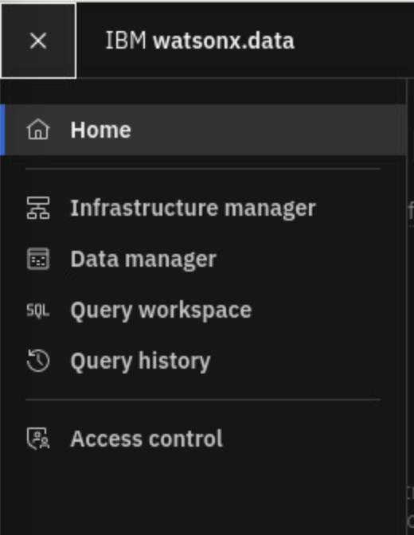
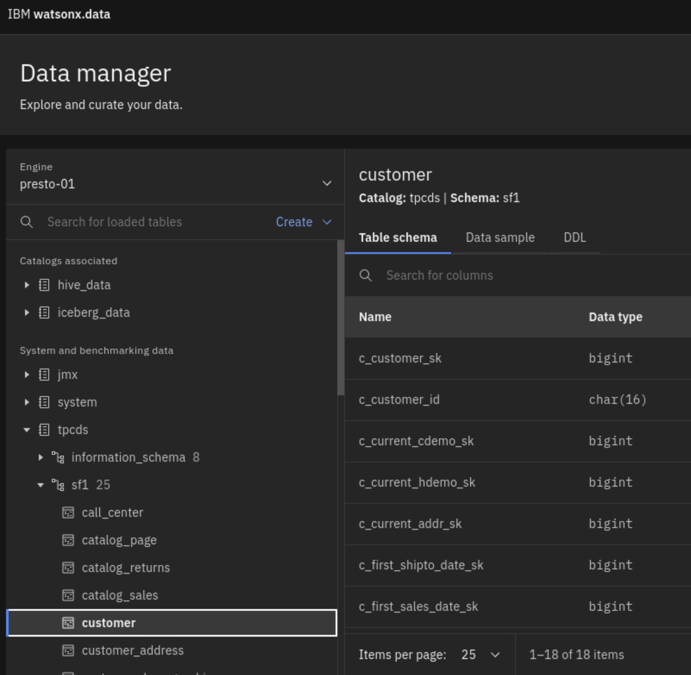
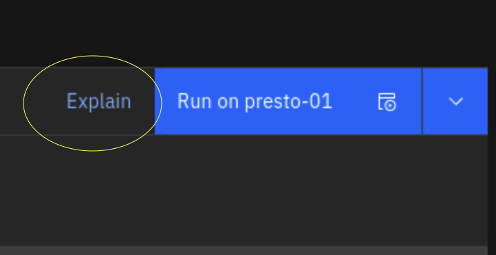
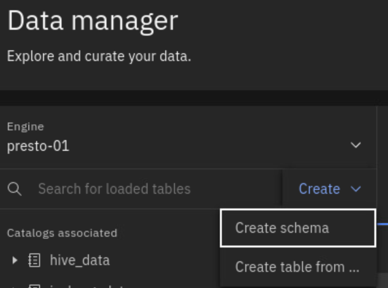
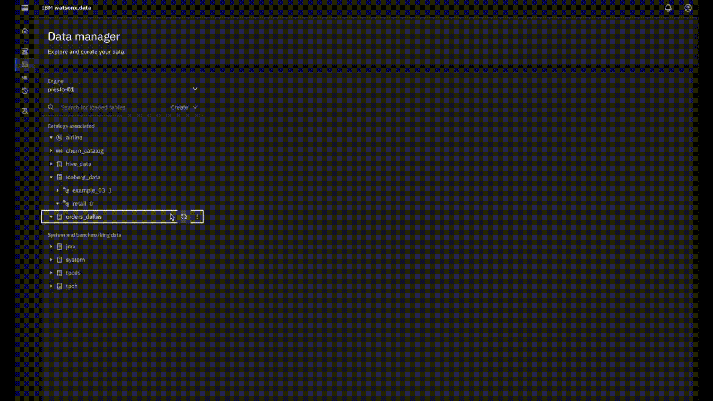

<CENTER>
<br>
<span style="font-weight:700;font-size:20px">
Dive into the watsonx.data Lakehouse with the Developer Edition
</span>
</CENTER>
<br>
<br>
<a href="https://reg.tools.ibm.com/flow/ibm/techxchange23/attendeeportal/page/sessioncatalog?search=3509">TechXchange 2023 Hands on lab Session 3509</a>
<br>
<br>


---

- [Lab Setup](#lab-setup)
  - [Clone this git repository](#clone-this-git-repository)
  - [Start all wxd containers](#start-all-wxd-containers)
    - [Check the status of all the containers](#check-the-status-of-all-the-containers)
- [A Quick tour of the wxd user experience](#a-quick-tour-of-the-wxd-user-experience)
- [Organizing data: Catalogs, Schemas and Tables](#organizing-data-catalogs-schemas-and-tables)
  - [Exercise 1: List catalogs and schema](#exercise-1-list-catalogs-and-schema)
  - [Exercise 2: List tables and query](#exercise-2-list-tables-and-query)
- [Accessing your own files inside the utility containers](#accessing-your-own-files-inside-the-utility-containers)
  - [Exercise 3: use presto-run to run a sql file](#exercise-3-use-presto-run-to-run-a-sql-file)
- [Creating schema and tables](#creating-schema-and-tables)
  - [Exercise 4: Create schema in the iceberg\_data Catalog](#exercise-4-create-schema-in-the-iceberg_data-catalog)
  - [Exercise 5: Create tables from csv files](#exercise-5-create-tables-from-csv-files)
- [SQL and Explains](#sql-and-explains)
  - [Exercise 6. Running queries](#exercise-6-running-queries)
- [Using DBeaver](#using-dbeaver)
  - [Exercise 7: Explore the watsonx.data lakehouse with DBeaver](#exercise-7-explore-the-watsonxdata-lakehouse-with-dbeaver)
- [Accessing data with Python](#accessing-data-with-python)
  - [Exercise 8: Working with the developer sandbox container](#exercise-8-working-with-the-developer-sandbox-container)
  - [Exercise 9: Using the python-run utility](#exercise-9-using-the-python-run-utility)
- [Federate external data](#federate-external-data)
  - [Setup PostgreSQL database](#setup-postgresql-database)
- [Access Policies: Securing data](#access-policies-securing-data)
- [Bringing data into your Lakehouse](#bringing-data-into-your-lakehouse)
- [Analytics and ML with Spark](#analytics-and-ml-with-spark)
- [Explore GraphQL for Data apps, powered by StepZen](#explore-graphql-for-data-apps-powered-by-stepzen)
- [Appendix and extra exercises](#appendix-and-extra-exercises)
  - [`ibm-lh-client` utilities](#ibm-lh-client-utilities)
  - [Accessing the minio S3 buckets](#accessing-the-minio-s3-buckets)


---


# Lab Setup

The environment for the lab includes a slightly customized installation of the watsonx.data (wxd) Developer edition and a set of other utilities for you to explore and experiment with the Lakehouse.  This environment also includes minio based S3 buckets for storing data and a PostgreSQL instance that we will use as part of the federated querying exercise.

The credentials for the installation will be shared during the event.

In the Event Cloud lab environment VM - 

``` 
sudo bash 

cd /root
```

You should see the Developer installation under `ibm-lh-dev/` and the Client installed under `ibm-lh-client/`

The Developer installation stands up a set of containers that represent the individual microservices of watsonx.data. Both the client and developer installation also includes utilities under `bin/` that are useful to interact with the watsonx.data services, including the Presto engine. The client installation is typically used to connect to a remote watsonx.data instance.

- If you intend to install them on your own machines, for installation documentation - see: [Installing the watsonx.data developer version](https://www.ibm.com/docs/en/watsonxdata/1.0.x?topic=edition-installing-watsonxdata-developer-version) and  [Installing ibm-lh-client](https://www.ibm.com/docs/en/watsonxdata/1.0.x?topic=package-installing-lh-client)


## Clone this git repository


From `Applications -> Utilities` in your VM, Launch `Terminal`

```
cd /home/watsonx

git clone https://github.com/IBM/watsonx-data.git

```

From Applications -> Internet, open up Google Chrome.

In the browser,  access `file:///home/watsonx/watsonx-data/tx3509-labs/README.MD` for the hands-on-lab content from the VM itself.

## Start all wxd containers

`ibm-lh-dev/bin/start`

### Check the status of all the containers

`ibm-lh-dev/bin/status --all`

```
ibm-lh-hive-metastore                           running
ibm-lh-minio                            running
ibm-lh-postgres                         running                 5432/tcp
ibm-lh-presto                           running                 0.0.0.0:8443->8443/tcp
lhconsole-api                           running                 3333/tcp, 8081/tcp
lhconsole-javaapi-svc                           running                 8667/tcp
lhconsole-nodeclient-svc                                running                 3001/tcp
lhconsole-ui                            running                 0.0.0.0:9443->8443/tcp

```

# A Quick tour of the wxd user experience


- To open the console UI, visit: https://localhost:9443 in the browser.  

    Use the menu on the left to navigate to various pages in the wxd user experience.

    <center>
    </img>
    </center>

    - In the **Infrastructure** page you can see which buckets and catalogs are already present. 

    - Use the **Data Manager** view to explore the catalogs and schema and the SQL view to run queries.

    The `iceberg_data` _catalog_ and `iceberg-bucket` _bucket_ is where we will load data into new tables and run queries. In the meantime, you can use the out of the box `tpcds` schema and explore 


    In the Data Manager view, expand on the left tree and select tables and view the table schema and sample data on the right.

    Here is an example of how to inspect the `customer` table in the `sf1` schema in the `tpcds` catalog.

    <center>
    </img >
    </center>

    **Note**: this is a very small VM environment, so use only the `tiny` or `sf1` schema. The other schemas have larger datasets that you may not always be able to query.

    From the SQL Query Workspace, choose one of the tpcds tables and generate a SELECT statement 

    <center>
      </img >
    </center>

    The SQL editor on the right can be used to run queries and inspect results. Use the `Run on presto-01` button to execute queries.

    <center>
      </img >
    </center>

   - Click on the `explain` button to visualize the plan for that query.

   The **Query History** page provides a list of all the queries run so far. It includes the queries that the browser itself had initiated.


- The Presto engine:

  The wxd installation includes one Presto engine container that serves as both the Coordinator and worker.  It is exposed on the host as port :8443
 
  The Presto Query monitoring UI is available via https://localhost:8443


---

# Organizing data: Catalogs, Schemas and Tables 

While you can use the wxd browser based user experience to explore Catalogs and Schemas, in this section, we will look at using the command line.

## Exercise 1: List catalogs and schema

Explore the Lakehouse, using the presto-run utility

-   List all catalogs:

```
   ibm-lh-dev/bin/presto-run --execute 'show catalogs'
"hive_data"
"iceberg_data"
"jmx"
"system"
"tpcds"
"tpch"

```

- List all schemas in the tpcds catalog:

```

ibm-lh-dev/bin/presto-run --catalog tpcds --execute 'show schemas'
"information_schema"
"sf1"
"sf10"
"sf100"
"sf1000"
"sf10000"
"sf100000"
"sf300"
"sf3000"
"sf30000"
"tiny"

```


## Exercise 2: List tables and query


- use presto CLI to browse schemas interactively

`ibm-lh-dev/bin/presto-cli --catalog tpcds`

```
presto> use tiny;
USE
presto:tiny> show tables;
:
:

```

- query with the presto-run utility

```
  ibm-lh-dev/bin/presto-run --catalog tpcds --execute 'select * from "tpcds"."sf1"."catalog_page" limit 10'
```

- use presto CLI to try queries interactively

    `ibm-lh-dev/bin/presto-cli --catalog tpcds`

    and from the prompt, run a sample select

    ```
    presto> select * from tiny.customer_demographics limit 10;

    presto> quit;

    ```

**Note**: The presto-run utility supports input via pipes while `presto-cli` does not.

for example:

`bin/presto-run --catalog=tpch <<< "select * from tiny.customer limit 10;"`

# Accessing your own files inside the utility containers

In some cases, you may want to work with files, say scripts or configuration, inside these containers. To mount your own directory with such content,  set LH_SANDBOX_DIR environment variable before launching any of the utilities.

```
mkdir -p /tmp/sbox
export LH_SANDBOX_DIR=/tmp/sbox
```

**Note**: it is highly recommend that you pick a directory solely meant for sharing files inside these containers and not mount directories such as your HOME as, with some operating systems & container runtimes, there could be issues with file permissions.

## Exercise 3: use presto-run to run a sql file

create a sql file under the sandbox directory. 

for example,

```

cat << EOF > $LH_SANDBOX_DIR/sample.sql
select 
*
from
tiny.catalog_page
LIMIT 10
;
EOF 

```

and run it

```
ibm-lh-dev/bin/presto-run --catalog=tpcds -f $LH_SANDBOX_DIR/sample.sql
```

---

# Creating schema and tables

## Exercise 4: Create schema in the iceberg_data Catalog

Note that creating a schema requires a location parameter to identify which path in the bucket to use for storing data

**Exercise 4a)** From the Data Manager UI, create a schema called 'retail',

<center>
  
</center>

<BR>

This will automatically pick a subpath in the underlying bucket.

You can also create a schema from the cmd line
<BR>

```

ibm-lh-dev/bin/presto-run --catalog iceberg_data --execute "CREATE SCHEMA IF NOT EXISTS retain with (location='s3a://iceberg-bucket/retail/')"

```

**Exercise 4b)** Creating tables

for example:  

```
CREATE TABLE iceberg_data.retail.region (
 "regionkey" bigint NOT NULL,
   "name" varchar(25) NOT NULL,
   "comment" varchar(152) NOT NULL
)
```


**Exercise 4c)** Create table AS SQL

This enables you to create a table and copy data from another existing table.

for example:

```
ibm-lh-dev/bin/presto-run --catalog iceberg_data --execute 'create table iceberg_data.retail.big_sup as select * from tpch.tiny.supplier where acctbal > 2300.00'
```

**Exercise 4d):** Create another schema and tables

In the iceberg_data catalog, create another schema with a different subpath from the command line

Copy another table from tpcds.tiny into the new schema.

---

## Exercise 5: Create tables from csv files

To set up the next few exercises we will create additional tables in the newly created `retail` schema and load them with sample data.


We will be creating 5 tables in the `retail` schema each from its own .csv file.

| Table name    | csv data  file                 |
| --------------| -------------------------------|
| customer      | [CUSTOMER.csv](./data/CUSTOMER.csv) |
| orders        | [ORDERS.csv](./data/ORDERS.csv)     |
| nation        | [NATION.csv](./data/NATION.csv)     |
| lineitem      | [LINEITEM.csv](./data/LINEITEM.csv) |
| part          | [PART.csv](./data/PART.csv)         |

For this purpose, we will use the Data Manager capability in the wxd UI.

Use the following recording as a guide to load sample csv via the browser.

<BR>

<BR>

- create tables with the name shown above from the corresponding CSVs in the `./data` directory. 

**Note**: later on in this lab, you will see how to ingest *large* data into the Lakehouse. The browser based mechanism shown above is only for tiny loads and primarily for demo purposes.

---

# SQL and Explains

## Exercise 6. Running queries

**Exercise 6a) Use a Windowing function**

find the orders table's location and run query 

```
SELECT
  orderkey,
  orderstatus,
  totalprice,
  rank() OVER (
    PARTITION BY orderstatus
    ORDER BY
      totalprice DESC
  ) AS rnk
FROM
  <catalog>.<schema>.orders 
ORDER BY
  orderstatus,
  rnk;
```

**Exercise 6b) View Explain**

Try "Explain" in the watsonx UI's SQL Editor after updating the location of these tables

```
SELECT
  name,
  orderkey,
  orderstatus,
  totalprice,
  rank() OVER (
    PARTITION BY orderstatus
    ORDER BY
      totalprice DESC
  ) AS rnk
FROM
  <catalog>.<schema>.orders t1,
  <catalog>.<schema>.customer t2
where
  t1.custkey = t2.custkey
ORDER BY
  orderstatus,
  rnk;
```

**Exercise 6c) Understand Presto explain text output**

- expain a simple table scan

```
ibm-lh-dev/bin/presto-run --catalog iceberg_data --execute 'explain select name, mktsegment from iceberg_data.retail.customer;'
```

- type io

```
ibm-lh-dev/bin/presto-run --catalog iceberg_data --execute 'explain (type io) select name, mktsegment from iceberg_data.retail.customer;'
```

- type distributed

```
ibm-lh-dev/bin/presto-run --catalog iceberg_data --execute 'explain (type distributed) select name, mktsegment from iceberg_data.retail.customer;'
```


**Exercise 6d)** : Try other options with the window functions including aggregate functions, previous record, next record and running totals.

**Exercise 6e)** : Try to write a window function to show the custkey, orderdate, totalprice and priororder. The output should look like this.

```
custkey | orderdate  | totalprice | priororder 
---------+------------+------------+------------
       1 | 1993-06-05 |  152411.41 | NULL       
       1 | 1993-08-13 |   83095.85 |  152411.41 
       1 | 1994-05-08 |   51134.82 |   83095.85 
       1 | 1995-10-29 |  165928.33 |   51134.82 
       1 | 1997-01-29 |  231040.44 |  165928.33 
       1 | 1997-03-04 |  270087.44 |  231040.44 
       1 | 1997-06-23 |  357345.46 |  270087.44 
       1 | 1997-11-18 |   28599.83 |  357345.46 
       1 | 1998-03-29 |   89230.03 |   28599.83 
       2 | 1993-02-19 |  170842.93 |   89230.03 
       2 | 1993-05-03 |  154867.09 |  170842.93 
       2 | 1993-09-30 |   143707.7 |  154867.09 
       2 | 1994-08-15 |  116247.57 |   143707.7 
       2 | 1994-12-29 |   45657.87 |  116247.57 
       2 | 1996-03-04 |   181875.6 |   45657.87 

```

**Exercise 6f)  Using a prepared query**

use the presto-cli utility 

```
prepare customer_by_segment from select * from customer where mktsegment=?;
execute customer_by_segment using 'MACHINERY';
```

---

# Using DBeaver

## Exercise 7: Explore the watsonx.data lakehouse with DBeaver

- There is a convenient [DBeaver](https://dbeaver.io/) installation in the lab virtual machine.

You can also navigate the Catalogs and schema in your wxd lakehouse using DBeaver and run SQL queries.

For this exercise, proceed to:  [Launching and using DBeaver with wxd](DBeaver.md)  


---

# Accessing data with Python


Note: both the `ibm-lh-dev` and `ibm-lh-client` packages include python packages inside a container image to make it easier to try out python against watsonx.data. In this section, we will be use the utilities from `ibm-lh-dev`. See the appendix for information on the [`ibm-lh-client` utilities](#ibm-lh-client-utilities).

## Exercise 8: Working with the developer sandbox container

The developer sandbox provides an environment with useful utilities and packages to help explore the lakehouse

a) To launch the sandbox:

   `ibm-lh-dev/bin/dev-sandbox`

to get bash prompt

You will also find the  $LH_SANDBOX_DIR` mounted inside the container.

`ls /tmp/sbox/` 

You can use `vi` to author python or sql scripts. For example `vi /tmp/sbox/sample.sql` to alter the sql and rerun.

b) create a file /tmp/sbox/sample.py with the following contents

```
import os
import prestodb

username=os.environ["LH_AUTH_USERNAME"]
password=os.environ["LH_AUTH_PASSWORD"]
hostname="ibm-lh-presto-svc"
portnumber="8443"
cert_location='/mnt/infra/tls/cert.crt'

with prestodb.dbapi.connect(
host=hostname,
port=portnumber,
user=username,
catalog='tpch',
schema='tiny',
http_scheme='https',
auth=prestodb.auth.BasicAuthentication(username,password)
) as conn:
  conn._http_session.verify = cert_location
  cur = conn.cursor()
  cur.execute('select * from tpch.tiny.customer limit 10')
  rows = cur.fetchall()
  print(rows)
```

and run it inside the sandbox container itself.

`python3 /tmp/sbox/sample.py` 

You will note that the sandbox container has your credentials injected into it.

- exit from the sandbox container once you are done.

c) Launch an interactive python interpreter session

You can also use the same dev-sandbox container for launching python3 directly

for example:

`ibm-lh-dev/bin/dev-sandbox -c python3`

## Exercise 9: Using the python-run utility

The `python-run` utility is a wrapper that triggers the execution of a python script inside a containerized environment.

For example,

`ibm-lh-dev/bin/python-run /tmp/sbox/sample.py`

**Exercise**:  write a python program that uses a windowing function similar to the one in - [Exercise 6a](#exercise-6--queries)

---

# Federate external data

In this example, we will join data from a PostgreSQL database with iceberg tables in the `retail` schema.

## Setup PostgreSQL database

# Access Policies: Securing data

# Bringing data into your Lakehouse

# Analytics and ML with Spark

# Explore GraphQL for Data apps, powered by StepZen

---

# Appendix and extra exercises

##  `ibm-lh-client` utilities

Take [a short tour of the `ibm-lh-client` utilities](./lh-client.md)

##  Accessing the minio S3 buckets

[View the bucket contents using the minio console](./inspect-bucket.md)
